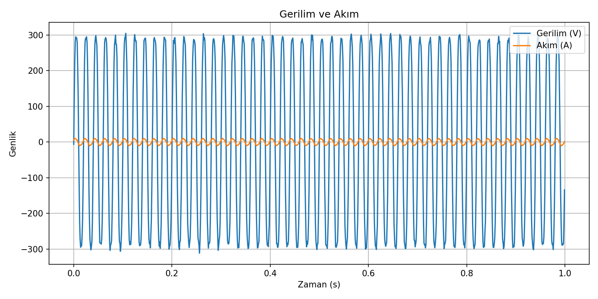
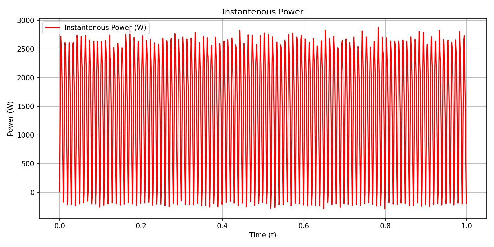
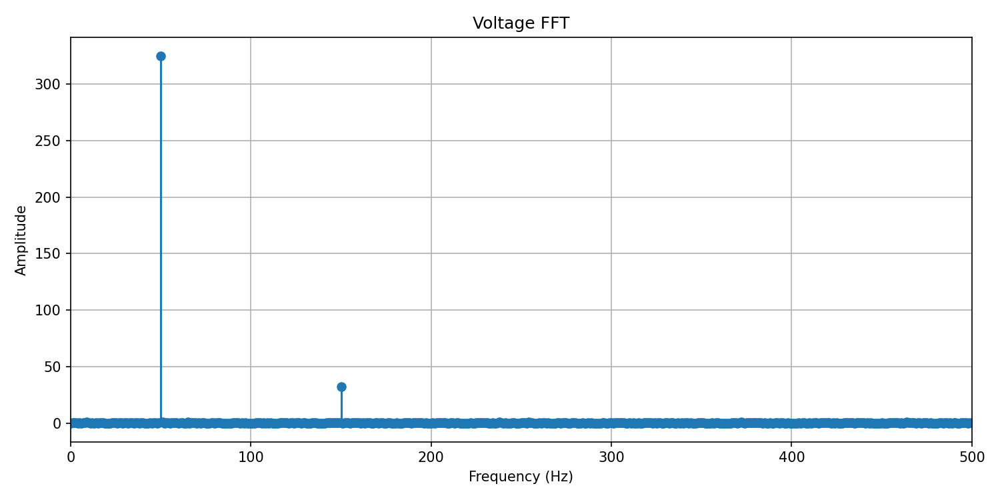
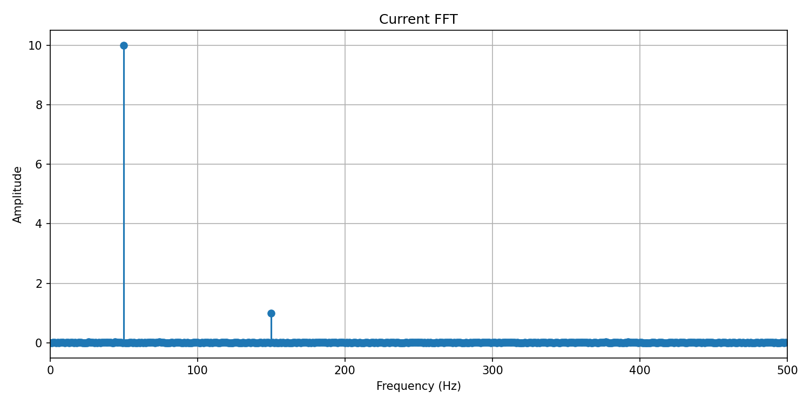

# ⚡ Power Analyzer Simulation
```
A Python project that simulates fundamental concepts of electrical power systems (RMS, active power, power factor, phase shift, THD) in a software environment.
This repository is designed both for learning purposes and as a stepping stone towards hardware-based power analyzers.
```
---

## 🚀 Features
```
- Synthetic generation of voltage and current signals (phase shift, harmonics, noise injection)
- RMS, active power, and power factor calculations
- Phase shift detection using FFT-based method
- FFT analysis and Total Harmonic Distortion (THD) measurement
- Graphical outputs saved automatically (time-domain, frequency-domain, instantaneous power)
```
---

## 📂 Project Structure

```
power-analyzer-sim/
│── data/            # Sample signals (CSV)
│── figures/         # Generated plots
│── src/             # Source modules
│   ├── generate_signals.py
│   ├── calculations.py
│   ├── fft_analysis.py
│   ├── visualize.py
│── tests/           # Unit tests
│── main.py          # Entry point
│── requirements.txt
│── README.md
│── LICENSE
```


---

## 🖥️ Installation

```bash
git clone https://github.com/kullanici/power-analyzer-sim.git
cd power-analyzer-sim
python -m venv .venv
.venv\Scripts\activate  # (Windows)
pip install -r requirements.txt
python main.py
```

## 📊 Example Output

```

=== Power Analyzer Results ===
Vrms: 229.81 V
Irms: 7.07 A
Active Power (P): 1407.29 W
Power Factor (PF): 0.866
Phase Shift: 30.00°
Voltage THD: 10.20%
Current THD: 10.35%

```

## 📈 Figures

- Voltage & Current:  


- Instantaneous Power:  


- Voltage FFT:  


- Current FFT:  



## 🎯 Roadmap
```
- Implement zero-crossing method for phase detection
- Add more complex harmonic combinations
- Integrate real sensor data (hardware support)
- Build a simple GUI (Tkinter/Dash)
```

## 🔢 Mathematical Formulas

- RMS (Root Mean Square):  
  `Vrms = sqrt( (1/T) * ∫ v(t)^2 dt )`

- Aktif Güç:  
  `P = Vrms * Irms * cos(phi)`

- Reaktif Güç:  
  `Q = Vrms * Irms * sin(phi)`

- Toplam Harmonik Distorsiyon (THD):  
  `THD = sqrt(V2^2 + V3^2 + ... ) / V1`

## 📚 References

- *Electrical Power Systems Basics* (Thomas Wildi)  
- [NumPy Documentation](https://numpy.org/doc/stable/)  
- [SciPy Signal Processing](https://docs.scipy.org/doc/scipy/reference/signal.html)


